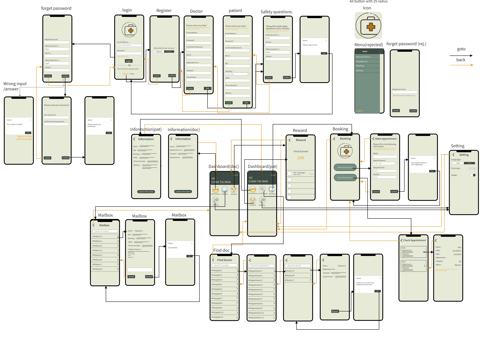

# E-Medical
In the E-Medical, we will mainly use bloackchain to process the transaction between patient and doctor, the doctor needs to have the patient’s permission to view and edit the medical history, and the patient themselves just can view the medical history and give the permission to the doctor, they don’t have permission to edit medical history because we assume that patient doesn’t have any knowledge in this domain, that is the main goal of this project.

## Wireframe


## Requirement
### Golang
Install golang from [https://golang.org/dl/](https://golang.org/dl/)
### node
Install node from [https://nodejs.org/en/](https://nodejs.org/en/)
### mongodb
Install mongodb from [https://www.mongodb.com/download-center/community/](https://www.mongodb.com/download-center/community/)

## Configuration
Edit mongo db uri from main.go file. And install all npm packages for web app. Using command:
```
cd webapp
npm install
```

## Running
Run the following command to start the server.
```
go run main.go
```

Run the following command to start the webapp.
```
npm run start
```
